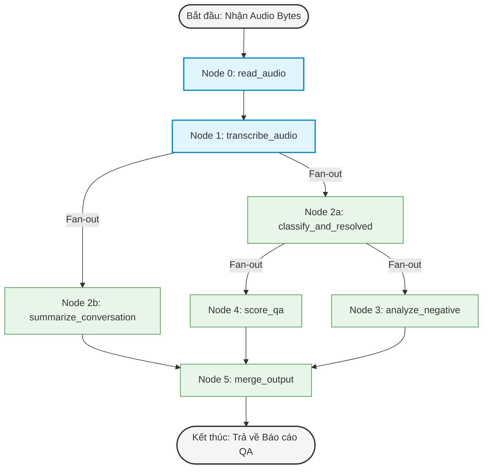
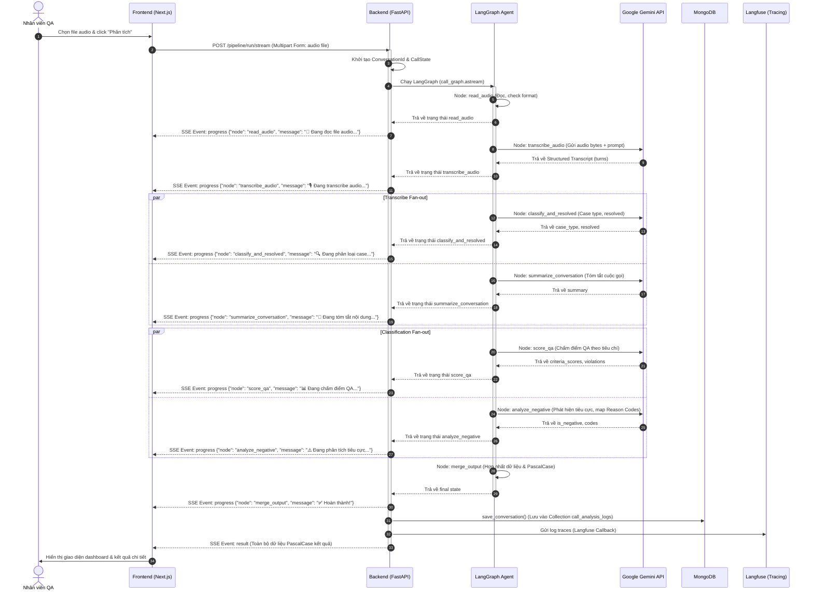

# BÁO CÁO KỸ THUẬT & TÀI LIỆU HỆ THỐNG
## HỆ THỐNG PHÂN TÍCH CHẤT LƯỢNG CUỘC GỌI CSKH TỰ ĐỘNG BẰNG AI AGENT (CS AGENT QA)

**Đồ án tốt nghiệp** | Ngày: 27/05/2026  
**Sinh viên thực hiện:** Nguyễn Thắng  
**Loại hệ thống:** Agentic AI Pipeline — Phân tích chất lượng cuộc gọi CSKH  

---

## 1. Tổng Quan Hệ Thống

### 1.1 Mục Tiêu Bài Toán
Trong hoạt động chăm sóc khách hàng (CSKH), việc đánh giá chất lượng cuộc gọi (Quality Assurance — QA) truyền thống đòi hỏi nhân sự nghe lại từng cuộc gọi, ghi nhận vi phạm, và chấm điểm thủ công. Quá trình này tốn nhiều thời gian, dễ bị sai số chủ quan, và không thể mở rộng quy mô.

Đồ án xây dựng hệ thống **CS Agent QA** — một tác nhân AI (AI Agent) hoạt động hoàn toàn tự động nhằm:
*   **Nhận diện và phân loại** loại vấn đề của từng cuộc gọi (case type).
*   **Đánh giá mức độ giải quyết** vấn đề của nhân viên (resolved / unresolved).
*   **Chấm điểm QA** theo bộ tiêu chí đa chiều: Giao tiếp, Thái độ, Thu thập dữ liệu, Giải quyết vấn đề.
*   **Phát hiện tương tác tiêu cực** và mã hóa nguyên nhân.
*   **Tóm tắt nội dung** cuộc gọi dưới dạng văn bản có cấu trúc.
*   **Lưu trữ và quản lý** kết quả phân tích để kiểm tra và hiệu chỉnh thủ công (Human-in-the-loop).

### 1.2 Phạm Vi Hệ Thống
Hệ thống bao gồm 3 phần chính:
1.  **Next.js Frontend (Dashboard):** Giao diện upload file audio, xem tiến độ xử lý thời gian thực, xem dashboard chi tiết kết quả QA và quản lý lịch sử (chỉnh sửa thủ công kết quả AI).
2.  **FastAPI Backend Server:** Router RESTful API kết hợp SSE (Server-Sent Events) để stream tiến độ của AI Agent và Motor để lưu trữ bất đồng bộ vào MongoDB.
3.  **LangGraph Agentic Pipeline:** Xây dựng quy trình phân tích bất đồng bộ dạng DAG song song, tích hợp Google Gemini Multimodal LLM cho phép đọc trực tiếp audio và xuất ra kết quả có cấu trúc (Pydantic parsing).

```
┌─────────────────────────────────────────────────────────────────┐
│                        CS Agent QA System                       │
│                                                                 │
│  ┌──────────────┐    ┌─────────────────┐    ┌───────────────┐  │
│  │  Next.js UI  │◄──►│  FastAPI Server │◄──►│   MongoDB     │  │
│  │  (Dashboard) │    │  (REST + SSE)   │    │  (Storage)    │  │
│  │              │    │  [Port 8000]    │    │               │  │
│  └──────────────┘    └────────┬────────┘    └───────────────┘  │
│    [Port 3000]                │                                 │
│                      ┌────────▼────────┐                        │
│                      │  LangGraph AI   │                        │
│                      │  Agent Pipeline │                        │
│                      └────────┬────────┘                        │
│                               │                                 │
│                      ┌────────▼────────┐                        │
│                      │  Google Gemini  │                        │
│                      │ (Gemini 3.5/3.2)│                        │
│                      └────────┬────────┘                        │
│                               │                                 │
│                      ┌────────▼────────┐                        │
│                      │    Langfuse     │                        │
│                      │ (Observability) │                        │
│                      └─────────────────┘                        │
└─────────────────────────────────────────────────────────────────┘
```

---

## 2. Kiến Trúc Phân Lớp (Layered Architecture)

Hệ thống được tổ chức theo kiến trúc phân lớp rõ ràng nhằm phân chia rạch ròi trách nhiệm (Separation of Concerns):

| Lớp | Thư mục | Trách nhiệm |
| :--- | :--- | :--- |
| **Presentation** | `frontend/` | Giao diện người dùng Next.js + Tailwind CSS + TypeScript |
| **API Layer** | `src/api/routes/` | Định nghĩa HTTP endpoints (FastAPI Router) |
| **Service Layer** | `src/services/` | Điều phối logic (Orchestration), quản lý luồng đồng thời bằng semaphore |
| **Agent/Graph Layer** | `src/graph/` | LangGraph workflow định nghĩa các node, edge và bộ nhớ State chung |
| **Core** | `src/core/` | Cấu hình hệ thống (Pydantic Settings), Logging, LLM Client (LangChain Google GenAI) |
| **Data Layer** | `src/db/` | Kết nối MongoDB bất đồng bộ sử dụng Motor driver |
| **Models** | `src/models/` | Định nghĩa cấu trúc dữ liệu Input/Output thông qua Pydantic models |

### Cấu Trúc Thư Mục Chi Tiết
```
.
├── Dockerfile                   # Dockerfile xây dựng Backend
├── README.md                    # Tài liệu hệ thống (File này)
├── data/                        # Thư mục lưu trữ dữ liệu tạm thời
├── docker-compose.yml           # Khởi chạy fullstack Backend, Frontend, MongoDB
├── docs/                        # Tài liệu đính kèm (Rubric Excel, Word docs)
├── frontend/                    # Mã nguồn Frontend Next.js
│   ├── app/                     # Next.js App Router (Layouts & Pages)
│   │   ├── history/             # Trang xem lịch sử & chỉnh sửa báo cáo
│   │   │   ├── [id]/            # Chi tiết một báo cáo & chỉnh sửa (Human-in-the-loop)
│   │   │   └── page.tsx         # Danh sách báo cáo phân tích
│   │   ├── layout.tsx           # Layout dùng chung cho Dashboard
│   │   └── page.tsx             # Trang chính (Upload & Streaming)
│   ├── components/              # React Components (UploadForm, ResultDashboard, Icons)
│   └── package.json
├── requirements.txt             # Thư viện Backend Python
├── src/                         # Mã nguồn Backend FastAPI
│   ├── main.py                  # Entrypoint khởi chạy server FastAPI
│   ├── api/                     # Lớp API Route
│   │   └── routes/              # router pipeline, conversations, connections, health
│   ├── core/                    # Lớp Core (Config, LLM Client, Logger)
│   ├── db/                      # Lớp Data Access (MongoDB Client & CRUD)
│   ├── graph/                   # Lớp Agentic Pipeline (LangGraph Workflow)
│   │   ├── nodes/               # Các node xử lý độc lập (transcribe, scoring, negative...)
│   │   ├── call_graph.py        # Định nghĩa liên kết DAG trong LangGraph
│   │   └── state.py             # Bộ nhớ State chung của Graph
│   ├── models/                  # Lớp Pydantic Models (CRM schema, Pipeline outputs)
│   └── services/                # Lớp Health Service kiểm tra kết nối
└── tests/                       # Thư mục kiểm thử API (pytest)
```

---

## 3. Biểu Đồ Use Case & Luồng Nghiệp Vụ

### 3.1 Biểu Đồ Use Case Hệ Thống
Hệ thống phục vụ trực tiếp cho vai trò **Nhân viên giám sát chất lượng (QA)** để phân tích các cuộc gọi chăm sóc khách hàng và đồng bộ thông tin sang hệ thống CRM.

```mermaid
flowchart TD
    QA[Nhân viên QA]
    CRM[Hệ thống CRM]
    
    subgraph Use Cases (Các chức năng chính)
        UC1(Khởi chạy phân tích - Upload Audio)
        UC2(Theo dõi tiến độ AI thời gian thực - SSE)
        UC3(Xem danh sách lịch sử phân tích)
        UC4(Xem chi tiết báo cáo QA cuộc gọi)
        UC5(Hiệu chỉnh báo cáo QA - Human-in-the-loop)
        UC6(Xóa báo cáo phân tích)
        UC7(Kiểm tra trạng thái kết nối - MongoDB, Gemini)
    end
    
    QA --> UC1
    QA --> UC2
    QA --> UC3
    QA --> UC4
    QA --> UC5
    QA --> UC6
    QA --> UC7
    
    UC1 -.->|Đồng bộ kết quả PascalCase| CRM
    UC5 -.->|Đồng bộ cập nhật| CRM
```

### 3.2 Đặc Tả Luồng Nghiệp Vụ Các Use Case Chính

#### Use Case 1: Upload & Phân Tích Âm Thanh Cuộc Gọi (Real-time SSE)
*   **Tác nhân:** Nhân viên QA.
*   **Đầu vào:** File audio (WAV, MP3, M4A, FLAC).
*   **Luồng chính:**
    1. Nhân viên QA kéo thả hoặc chọn file audio hợp lệ tại màn hình Dashboard.
    2. Click nút "Phân tích cuộc gọi".
    3. Hệ thống Backend nhận file, khởi tạo trạng thái và chạy LangGraph Agent Pipeline.
    4. Trong quá trình chạy, các node hoàn thành sẽ gửi Event SSE về Frontend để cập nhật tiến độ (Progress bar).
    5. Khi Agent chạy xong, Backend lưu kết quả vào MongoDB và gửi Event `result` chứa toàn bộ nội dung phân tích chi tiết.
    6. Màn hình tự động hiển thị Dashboard phân tích chi tiết.

#### Use Case 2: Hiệu Chỉnh Kết Quả Phân Tích (Human-in-the-loop QA)
*   **Tác nhân:** Nhân viên QA.
*   **Đầu vào:** Các trường sửa đổi (CaseType, Resolved, IsNegative, Summary...).
*   **Luồng chính:**
    1. Nhân viên QA truy cập trang lịch sử cuộc gọi, chọn xem chi tiết một cuộc gọi cụ thể.
    2. Nếu phát hiện AI phân loại nhầm hoặc tóm tắt chưa đủ ý, QA click sửa trực tiếp trên giao diện (ví dụ: chuyển từ trạng thái Tiêu cực sang Bình thường hoặc chỉnh sửa nội dung Summary).
    3. Click "Lưu thay đổi".
    4. Frontend gửi request `PATCH /conversations/{id}` lên Backend.
    5. Backend kiểm tra tính hợp lệ của các trường dữ liệu được chỉnh sửa, cập nhật MongoDB, cập nhật trường `updated_at` và trả về bản ghi mới nhất.

---

## 4. Kiến Trúc AI Agent — LangGraph Pipeline

### 4.1 Bộ Nhớ Trạng Thái Chung (Graph State)
Tất cả các node trong đồ thị trao đổi dữ liệu qua `CallState` (định nghĩa tại [src/graph/state.py](file:///Users/thangnguyen/Documents/DATN/src/graph/state.py)). Ở node cuối cùng, các trường dữ liệu snake_case nội bộ được chuẩn hóa sang định dạng PascalCase phù hợp với CRM:

```python
class CallState(TypedDict, total=False):
    # Input
    call_id: str | None
    audio_link: str                    # URL audio (nếu dùng download node)
    
    # Internal
    audio_bytes: bytes                 # Dữ liệu file nhị phân
    audio_format: str                  # Định dạng wav, mp3, m4a...
    conversation_id: str               # Mã ID cuộc hội thoại
    
    # Node Outputs
    transcript: str                    # Chuỗi text cuộc hội thoại phẳng
    transcript_turns: list[dict]       # Danh sách các lượt thoại [{speaker, text}]
    case_type: str                     # Loại vấn đề
    resolved: Literal["YES", "NO", "REVIEW"] # Trạng thái giải quyết
    is_negative: Literal["TRUE", "FALSE", "REVIEW"] # Tương tác tiêu cực
    negative_reason_code: list[str]    # Mã lý do tiêu cực
    negative_reason_description: list[str] # Chi tiết lý do tiêu cực
    criteria_scores: dict[str, float]  # Điểm các tiêu chí
    total_score: float                 # Tổng điểm QA cuối cùng
    violations: list[dict]             # Danh sách các vi phạm được phát hiện
    summary: str                       # Tóm tắt hội thoại
    
    # Output CRM (PascalCase)
    ConversationId: str
    Transcript: list[dict]
    Summary: str
    IsNegative: str
    NegativeReasonCode: list[str]
    NegativeReasonDescription: list[str]
    CriteriaScores: dict
    CaseType: str
    Resolved: str
    Violations: list[dict]
```

### 4.2 Sơ Đồ Luồng Hoạt Động Của LangGraph Pipeline
Pipeline được tối ưu hóa bằng cách kết hợp giữa xử lý tuần tự (Sequential) và xử lý song song (Parallel Fan-out / Fan-in) để rút ngắn tối đa thời gian phản hồi từ LLM:



### 4.3 Chi Tiết Từng Node & Logic Nghiệp Vụ

#### Node 0: Đọc File Audio (`read_audio`)
*   **Mô tả:** Đọc và kiểm tra tính hợp lệ của file audio (đảm bảo tệp tin thuộc định dạng `wav`, `mp3`, `m4a`, `flac`, `ogg`). Nếu không có dữ liệu bytes trong state, ném lỗi `ValueError`.

#### Node 1: Phiên Âm Đa Phương Tiện (`transcribe_audio`)
*   **Mô tả:** Chuyển đổi file audio thành văn bản hội thoại chi tiết theo từng lượt nói (Speaker Diarization).
*   **Công nghệ:** Tận dụng khả năng xử lý **Multimodal (Âm thanh + Văn bản)** trực tiếp của Google Gemini. Gửi trực tiếp audio bytes dạng base64 kèm prompt yêu cầu phân tách rõ speaker.
*   **Cấu trúc Đầu ra (Pydantic):**
    ```python
    class TranscriptTurn(BaseModel):
        speaker: Literal["agent", "customer"]
        text: str

    class TranscribeOutput(BaseModel):
        transcript: List[TranscriptTurn]
    ```

#### Node 2a: Phân Loại Vấn Đề (`classify_and_resolved`)
*   **Mô tả:** Phân loại cuộc gọi dựa trên transcript sang Case Type tương ứng và đánh giá nhanh khách hàng đã hài lòng / giải quyết được vấn đề hay chưa.
*   **Cấu trúc Đầu ra (Pydantic):**
    ```python
    class ClassificationResolvedOutput(BaseModel):
        case_type: str
        resolved: Literal["YES", "NO", "REVIEW"]
    ```

#### Node 2b: Tóm Tắt Cuộc Gọi (`summarize_conversation`)
*   **Mô tả:** Tạo tóm tắt hội thoại ngắn gọn, súc tích.
*   **Logic Nghiệp vụ:** Chọn prompt tóm tắt thông minh dựa trên hướng cuộc gọi (`direction`). Nếu là Outbound (gọi đi) dùng prompt nhấn mạnh hành động tiếp theo của Agent, nếu là Inbound (gọi đến) tập trung vào vấn đề khách hàng đang phản ánh.
*   **Cấu trúc Đầu ra (Pydantic):**
    ```python
    class SummaryOutput(BaseModel):
        summary: str
    ```

#### Node 3: Phân Tích Tương Tác Tiêu Cực (`analyze_negative`)
*   **Mô tả:** Phát hiện các biểu hiện tiêu cực, bức xúc của khách hàng hoặc thái độ tranh cãi của nhân viên.
*   **Logic Nghiệp vụ:** Nếu `resolved == "YES"` (vấn đề đã giải quyết tốt), hệ thống ghi đè trạng thái `is_negative = "FALSE"` nhằm tránh các cảnh báo giả. Nếu có vi phạm tiêu cực, hệ thống thực hiện map mã lý do (Reason Code) tương ứng từ bản đồ nghiệp vụ.
*   **Cấu trúc Đầu ra (Pydantic):**
    ```python
    class NegativeDetectionOutput(BaseModel):
        is_negative: Literal["TRUE", "FALSE", "REVIEW"]
        negative_reason_code: List[Literal["C1", "C2", "C3", "C4", "C5", "C6", "C7", "C8", "C9", "A1", "A2", "A3", "A4"]]
        negative_reason_description: List[str]
    ```

#### Node 4: Chấm Điểm Chất Lượng QA (`score_qa`)
*   **Mô tả:** Chấm điểm nhân viên CSKH dựa trên bộ tiêu chí tiêu chuẩn. Trích xuất lỗi vi phạm (nếu có) kèm dẫn chứng (Evidence) cụ thể từ transcript.
*   **Bộ Tiêu Chí & Trọng Số:**
    *   **Giao tiếp (Communication) - 20%:** Chào hỏi chuẩn mẫu, không để khoảng lặng, diễn đạt rõ ràng...
    *   **Thái độ (Attitude) - 30%:** Nhiệt tình, ngắt lời khách hàng, đổ lỗi cho khách, tranh cãi tay đôi...
    *   **Thu thập dữ liệu (DataCollection) - 10%:** Khai thác đủ thông tin, không hỏi thừa...
    *   **Giải quyết vấn đề (ProblemSolving) - 40%:** Đưa ra giải pháp đúng, xử lý lỗi nhanh...
*   **Cấu trúc Đầu ra (Pydantic):**
    ```python
    class ViolationItem(BaseModel):
        criterion_id: Literal["communication", "attitude", "data_collection", "problem_solving"]
        violation_code: str
        description: str
        deduction: float
        evidence: List[ViolationEvidence]
        
    class QAScoringOutput(BaseModel):
        criteria_scores: CriteriaScores
        total_score: float
        violations: List[ViolationItem]
    ```

#### Node 5: Hợp Nhất Đầu Ra (`merge_output`)
*   **Mô tả:** Lắng nghe tất cả các nhánh song song hội tụ về. Tổng hợp dữ liệu từ `CallState` và parse sang định dạng PascalCase để trả về client và lưu trữ vào Database.

---

## 5. Sơ Đồ Tuần Tự Xử Lý Luồng SSE Stream

Quy trình giao tiếp bất đồng bộ giữa Client Frontend, Backend FastAPI Router, LangGraph và Google Gemini API được mô tả chi tiết qua sơ đồ tuần tự dưới đây:



---

## 6. Thiết Kế Cơ Sở Dữ Liệu

Hệ thống sử dụng cơ sở dữ liệu phi quan hệ **MongoDB** để lưu trữ các báo cáo phân tích chất lượng cuộc gọi.

*   **Database:** `ai_call_summary`
*   **Collection:** `call_analysis_logs` (lấy cấu hình từ biến môi trường `MONGODB_COLLECTION_CALLS`).

### 6.1 Tài Liệu Schema Collection `call_analysis_logs`

Mỗi tài liệu (document) lưu trữ thông tin phẳng ở cấp độ cao nhất kèm theo định dạng PascalCase để tương thích CRM:

| Trường | Kiểu dữ liệu | Mô tả |
| :--- | :--- | :--- |
| `_id` | String | Mã ID cuộc hội thoại (`ConversationId`), cấu trúc: `CALL-{YYYYMMDD}-{CALL_ID}` |
| `call_id` | String | Mã ID gốc của cuộc gọi (ví dụ: `CALL-F284BD80`) |
| `ConversationId` | String | Giống `_id`, dùng cho CRM |
| `CaseType` | String | Phân loại vấn đề cuộc gọi (ví dụ: `Hỗ trợ phần mềm`, `Hóa đơn`, `Khiếu nại`...) |
| `Resolved` | String | Trạng thái giải quyết: `YES`, `NO`, `REVIEW` |
| `IsNegative` | String | Tương tác tiêu cực: `TRUE`, `FALSE`, `REVIEW` |
| `NegativeReasonCode` | Array (String) | Mảng chứa các mã lý do tiêu cực (C1 - C9, A1 - A4) |
| `NegativeReasonDescription`| Array (String) | Mảng mô tả chi tiết tương ứng với các mã lý do |
| `Summary` | String | Văn bản tóm tắt nội dung chính cuộc gọi |
| `Transcript` | Array (Object) | Lượt hội thoại dạng: `[{"Speaker": "agent", "Text": "..."}, ...]` |
| `CriteriaScores` | Object | Điểm số các tiêu chí: `Communication`, `Attitude`, `DataCollection`, `ProblemSolving` |
| `Violations` | Array (Object) | Mảng chứa danh sách các lỗi vi phạm phát hiện trong cuộc gọi |
| `created_at` | Date/DateTime | Thời gian tạo báo cáo (UTC) |
| `updated_at` | Date/DateTime | Thời gian chỉnh sửa báo cáo gần nhất (UTC) |

### 6.2 Chi Tiết Cấu Trúc Rubric Chấm Điểm QA (Node 4)

Hệ thống thực hiện trừ điểm dựa trên thang điểm tối đa là **10 điểm** cho mỗi tiêu chí, nhân với trọng số tương ứng:

```
Tổng điểm QA = (Giao tiếp * 0.2) + (Thái độ * 0.3) + (Thu thập dữ liệu * 0.1) + (Giải quyết vấn đề * 0.4)
```

Dưới đây là danh sách chi tiết các mã lỗi vi phạm trong Rubric ([src/utils/constants.py](file:///Users/thangnguyen/Documents/DATN/src/utils/constants.py)):

#### 1. Tiêu chí Giao tiếp (Communication) - Trọng số: 20%
*   `GT_01`: Chào đầu chưa rõ ràng hoặc chưa đúng mẫu câu chuẩn. (Trừ 1đ)
*   `GT_02`: Kết thúc chưa rõ ràng hoặc chưa đúng mẫu câu chuẩn. (Trừ 1đ)
*   `GT_03`: Xưng hô không có chủ ngữ. (Trừ 1đ)
*   `GT_04`: Để khoảng lặng trong giao tiếp mà không xin phép KH. (Trừ 1đ)
*   `GT_05`: Để KH gọi/trao đổi mà không đáp, KH phải gọi lần 2 mới đáp. (Trừ 1đ)
*   `GT_06`: Không xin phép khách trước khi giữ/đợi để kiểm tra thông tin. (Trừ 1đ)
*   `GT_07`: Để KH nhắn tin/chat quá 2 phút mà không phản hồi. (Trừ 1đ)
*   `GT_08`: Yêu cầu KH chờ nhưng không cảm ơn sau khi khách chờ. (Trừ 1đ)
*   `GT_09`: Ngôn từ giao tiếp không lịch sự/cộc lốc/không phù hợp. (Trừ 1đ)
*   `GT_10`: Diễn đạt lan man/không đúng trọng tâm, gây khó hiểu. (Trừ 1đ)
*   `GT_11`: Dùng thuật ngữ/tiếng lóng/từ địa phương gây khó hiểu. (Trừ 1đ)
*   `GT_12`: Không tư vấn đủ 2 tính năng theo mẫu quy định. (Trừ 1đ)

#### 2. Tiêu chí Thái độ (Attitude) - Trọng số: 30%
*   `TD_01`: Thái độ thờ ơ, thiếu nhiệt tình, không đúng trọng tâm. (Trừ 1đ)
*   `TD_02`: Trả lời cho xong, không hỏi lại để xác minh thông tin. (Trừ 1đ)
*   `TD_03`: Ngắt lời khi KH đang trao đổi. (Trừ 1đ)
*   `TD_04`: Giao tiếp cứng nhắc làm KH phản ứng gay gắt. (Trừ 1đ)
*   `TD_05`: Chưa chủ động xin lỗi, trấn an khi KH gặp sự cố. (Trừ 1đ)
*   `TD_06`: Dùng câu cộc lốc thể hiện sự gắt gỏng. (Trừ 2đ)
*   `TD_07`: Đổ lỗi cho khách hàng. (Trừ 2đ)
*   `TD_08`: Tranh cãi/cãi tay đôi với KH. (Trừ 10đ)
*   `TD_09`: Thái độ coi thường, thách thức khách hàng. (Trừ 10đ)
*   `TD_10`: Ngôn từ thô tục, vô văn hóa. (Trừ 10đ)
*   `TD_11`: Cố tình thực hiện sai yêu cầu của khách và không phản hồi. (Trừ 10đ)
*   `TD_12`: Nhân viên CSKH yêu cầu ngược lại KH phải chủ động gọi lại. (Trừ 1đ)

#### 3. Tiêu chí Thu thập dữ liệu (DataCollection) - Trọng số: 10%
*   `TTDL_01`: Khai thác/xác nhận thiếu thông tin quan trọng. (Trừ 5đ)
*   `TTDL_02`: Không hỏi lại thông tin khách hàng cần hỗ trợ. (Trừ 5đ)
*   `TTDL_03`: Khai thác thừa thông tin không cần thiết. (Trừ 5đ)

#### 4. Tiêu chí Giải quyết vấn đề (ProblemSolving) - Trọng số: 40%
*   `GQVD_01`: KH phản hồi chưa được, chưa đúng yêu cầu mà nhân viên bỏ qua. (Trừ 10đ)
*   `GQVD_02`: Nhân viên không đưa ra được nguyên nhân, lý do lỗi. (Trừ 10đ)
*   `GQVD_03`: Nhân viên phản hồi cẩu thả: em không xử lý được, em không biết. (Trừ 10đ)
*   `GQVD_04`: Không thông báo cho khách biết tính năng chưa hỗ trợ. (Trừ 10đ)
*   `GQVD_05`: Không ghi nhận yêu cầu của khách vào hệ thống. (Trừ 10đ)
*   `GQVD_06`: Không hứa chuyển giao thông tin cho bộ phận kỹ thuật. (Trừ 10đ)
*   `GQVD_07`: Không khai thác đủ tình trạng lỗi của khách. (Trừ 10đ)
*   `GQVD_08`: Không ghi nhận lỗi hệ thống và đưa giải pháp tạm thời. (Trừ 10đ)
*   `GQVD_09`: Không xin lỗi và thừa nhận lỗi khi có lỗi dịch vụ. (Trừ 10đ)
*   `GQVD_10`: Không hỏi làm rõ thông tin chi tiết về vấn đề. (Trừ 10đ)

### 6.3 Danh Sách Mã Lý Do Tiêu Cực (Node 3)

*   **Nhóm lỗi từ phía Khách Hàng (Customer):**
    *   `C1`: Kết thúc hội thoại nhưng KH vẫn bức xúc.
    *   `C2`: KH gay gắt/mất kiểm soát/lặp phàn nàn nhiều lần.
    *   `C3`: Đe dọa khiếu nại/phản ánh cấp cao/đăng mạng xã hội.
    *   `C4`: Đòi hủy hợp đồng/ngừng sử dụng dịch vụ.
    *   `C5`: Yêu cầu gặp trực tiếp quản lý/lãnh đạo.
    *   `C6`: Cắt lời/không cho nhân viên giải thích.
    *   `C7`: So sánh tiêu cực chất lượng với đối thủ cạnh tranh.
    *   `C8`: Đòi xử lý ngay lập tức, không chấp nhận quy trình xử lý.
    *   `C9`: Thể hiện sự mất niềm tin hoàn toàn vào sản phẩm/dịch vụ.
*   **Nhóm lỗi từ phía Nhân Viên (Agent):**
    *   `A1`: Từ từ chối hỗ trợ không đúng quy định (không đưa phương án).
    *   `A2`: Đổ lỗi cho KH hoặc đổ lỗi cho bộ phận khác.
    *   `A3`: Ngôn từ chưa chuẩn mực, xúc phạm khách hàng.
    *   `A4`: Tranh cãi, cãi cọ trực tiếp với khách hàng.

---

## 7. Tài Liệu API Endpoints

FastAPI cung cấp các REST API endpoints tự động sinh tài liệu Swagger UI tại địa chỉ `http://localhost:8000/docs`.

### 7.1 POST `/pipeline/run/stream`
*   **Mô tả:** Upload file âm thanh cuộc gọi và nhận kết quả phân tích theo luồng thời gian thực SSE.
*   **Content-Type:** `multipart/form-data`
*   **Tham số Payload:**
    *   `audio` (File, Bắt buộc): Định dạng `.wav`, `.mp3`, `.m4a`, `.flac`, hoặc `.ogg`. Kích thước tối đa 50MB.
    *   `call_id` (String, Tùy chọn): ID định danh cuộc gọi. Nếu để trống hệ thống sẽ tự sinh UUID.
*   **Response:** Stream dữ liệu `text/event-stream`. Dữ liệu mỗi dòng có cấu trúc `data: {JSON}\n\n`.
    *   *Event progress:* `{"type": "progress", "node": "read_audio", "message": "📁 Đang đọc file audio...", "completed": ["read_audio"]}`
    *   *Event result:* `{"type": "result", "data": { ...CallAnalysisResult... }}`
    *   *Event error:* `{"type": "error", "message": "Chi tiết thông báo lỗi"}`

### 7.2 GET `/conversations`
*   **Mô tả:** Xem danh sách các cuộc gọi đã được phân tích chất lượng (sắp xếp mới nhất lên đầu).
*   **Tham số query:**
    *   `limit` (Integer, mặc định: 20): Số lượng bản ghi giới hạn trên một trang.
    *   `skip` (Integer, mặc định: 0): Số bản ghi bỏ qua (hỗ trợ phân trang).
*   **Response JSON:**
    ```json
    {
      "total": 1,
      "limit": 20,
      "skip": 0,
      "results": [
        {
          "_id": "CALL-20260527-CALL-F284BD80",
          "ConversationId": "CALL-20260527-CALL-F284BD80",
          "CaseType": "Hỗ trợ phần mềm",
          "Resolved": "YES",
          "IsNegative": "FALSE",
          "Summary": "Khách hàng liên hệ nhờ hỗ trợ kích hoạt bản quyền phần mềm...",
          "total_score": 9.5
        }
      ]
    }
    ```

### 7.3 GET `/conversations/{message_id}`
*   **Mô tả:** Xem chi tiết kết quả phân tích QA và toàn bộ transcript của một cuộc gọi cụ thể.
*   **Response JSON:** Trả về đối tượng đầy đủ bao gồm `Transcript`, `CriteriaScores`, `Violations`, `NegativeReasonCode`, v.v.

### 7.4 PATCH `/conversations/{message_id}`
*   **Mô tả:** Hiệu chỉnh thủ công kết quả do AI Agent phân tích sai (áp dụng pattern Human-in-the-loop).
*   **Request Body JSON:**
    ```json
    {
      "CaseType": "Khiếu nại dịch vụ",
      "Resolved": "NO",
      "IsNegative": "TRUE",
      "Summary": "Tóm tắt cuộc gọi đã hiệu chỉnh...",
      "NegativeReasonCode": "C2",
      "NegativeReasonDescription": "KH gay gắt/mất kiểm soát/lặp phàn nàn nhiều lần"
    }
    ```
*   **Response JSON:** Bản ghi đã được cập nhật thành công kèm theo thời gian chỉnh sửa mới nhất `updated_at`.

### 7.5 DELETE `/conversations/{message_id}`
*   **Mô tả:** Xóa vĩnh viễn báo cáo phân tích chất lượng cuộc gọi khỏi hệ thống cơ sở dữ liệu MongoDB.
*   **Response JSON:** `{"success": true, "deleted_id": "message_id"}`

### 7.6 GET `/connections`
*   **Mô tả:** Kiểm tra kết nối tới các dịch vụ hạ tầng phụ thuộc.
*   **Response JSON:**
    ```json
    {
      "mongodb": { "status": "ok", "uri": "...", "database": "ai_call_summary" },
      "gemini": { "status": "ok", "model": "gemini-3.5-flash" },
      "langfuse": { "status": "ok", "host": "https://cloud.langfuse.com" }
    }
    ```

---

## 8. Giao Diện & Trải Nghiệm Người Dùng (UI/UX)

Hệ thống Frontend Next.js được xây dựng theo ngôn ngữ thiết kế hiện đại, responsive tốt, sử dụng tông màu Slate tinh tế, sang trọng.

### 8.1 Trang Chủ: Upload & Stream Kết Quả (`/`)
*   **Khu vực Upload:** Hỗ trợ kéo thả tập tin (Drag and Drop) với hiệu ứng visual đổi màu trạng thái (xanh lá khi file sẵn sàng, xanh lam khi rê chuột).
*   **Thanh tiến độ thời gian thực (SSE):** Sử dụng danh sách node tiến trình `read_audio → transcribe_audio → classify_and_resolved → summarize_conversation → score_qa → analyze_negative → merge_output`. Node đang chạy hiển thị hiệu ứng động `animate-pulse` màu xanh dương, node đã chạy xong hiển thị dấu tick xanh lá cây và chuyển text sang xanh lá.
*   **Bảng Điều Khiển Kết Quả (ResultDashboard):**
    *   *Chỉ số tổng hợp:* 4 thẻ KPI nổi bật hiển thị nhanh phân loại lỗi, Trạng thái giải quyết (Resolved), Tương tác tiêu cực (Negative), và Tổng điểm QA (độ lớn điểm đổi màu tương ứng: đỏ dưới 5đ, vàng dưới 8đ, xanh lá từ 8đ trở lên).
    *   *Tiêu chí chấm điểm chi tiết:* Hiển thị thanh đo trực quan (Progress bar) cho 4 tiêu chí Giao tiếp (20%), Thái độ (30%), Thu thập thông tin (10%), Giải quyết vấn đề (40%).
    *   *Transcript chat-style:* Đoạn hội thoại phân tích speaker được hiển thị dưới dạng khung chat tin nhắn xanh-xám, phân biệt rõ lời thoại của Agent bên phải và Khách hàng bên trái.
    *   *Khung hiển thị vi phạm:* Liệt kê rõ ràng danh sách lỗi vi phạm kèm mô tả lỗi, điểm số bị trừ, và **bằng chứng cụ thể** (trích xuất câu thoại vi phạm trực tiếp).

### 8.2 Trang Lịch Sử & Chỉnh Sửa (`/history` và `/history/[id]`)
*   **Danh sách lịch sử (`/history`):** Hiển thị bảng tổng hợp kết quả phân tích từ trước đến nay. QA có thể tìm kiếm nhanh bằng bộ lọc trạng thái và phân loại nhanh. Nút "Xóa" cho phép dọn dẹp các báo cáo rác.
*   **Chi tiết & Chỉnh sửa (`/history/[id]`):** Cung cấp các trường Input và Textarea cho phép nhân viên QA dễ dàng chỉnh sửa lại các thông tin của báo cáo. Sau khi sửa đổi, hệ thống đồng bộ trực tiếp lên MongoDB thông qua request PATCH.

---

## 9. Hướng Dẫn Cài Đặt & Khởi Chạy

### 9.1 Yêu Cầu Hệ Thống (Prerequisites)
*   **Node.js:** Phiên bản 18.0.0 hoặc cao hơn.
*   **Python:** Phiên bản 3.11 hoặc cao hơn.
*   **MongoDB:** Local instance hoặc MongoDB Atlas Connection String.
*   **Google Gemini API Key:** Nhận miễn phí hoặc trả phí từ Google AI Studio.

### 9.2 Khởi Chạy Bằng Docker Compose (Nhanh Nhất)
Docker Compose cho phép khởi chạy đồng thời cả Backend FastAPI, Frontend Next.js và một instance MongoDB local:

1.  Sao chép file cấu hình mẫu `.env` và cập nhật khóa API Gemini của bạn:
    ```bash
    cp .env.example .env
    # Mở file .env và điền GEMINI_API_KEY="..."
    ```
2.  Khởi chạy hệ thống bằng Docker Compose:
    ```bash
    docker-compose up --build
    ```
3.  Truy cập các địa chỉ sau:
    *   **Frontend Dashboard:** `http://localhost:3000`
    *   **Backend REST API Docs:** `http://localhost:8000/docs`

---

### 9.3 Khởi Chạy Thủ Công Từng Phần (Local Development)

#### Bước 1: Khởi chạy Backend FastAPI
1.  Di chuyển vào thư mục dự án và tạo môi trường ảo Python:
    ```bash
    python3 -m venv .venv
    source .venv/bin/activate
    ```
2.  Cài đặt các thư viện phụ thuộc:
    ```bash
    pip install --upgrade pip
    pip install -r requirements.txt
    ```
3.  Cấu hình file môi trường `.env` ở thư mục gốc:
    ```ini
    APP_NAME="CS Agent QA API"
    APP_ENV=development
    HOST=0.0.0.0
    PORT=8000
    MAX_UPLOAD_BYTES=52428800
    PIPELINE_CONCURRENCY=2

    MONGODB_URI="mongodb://localhost:27017"
    MONGODB_DB_NAME="ai_call_summary"
    MONGODB_COLLECTION_CALLS="call_analysis_logs"
    MONGODB_TIMEOUT_MS=5000

    GEMINI_API_KEY="KHÓA_API_GEMINI_CỦA_BẠN"
    GEMINI_MODEL="gemini-3.5-flash"
    GEMINI_TEMPERATURE=0.2
    GEMINI_MAX_TOKENS=4096

    # Cấu hình Langfuse (Tùy chọn)
    LANGFUSE_PUBLIC_KEY="pk-lf-..."
    LANGFUSE_SECRET_KEY="sk-lf-..."
    LANGFUSE_HOST="https://cloud.langfuse.com"
    ```
4.  Chạy Backend API Server bằng Uvicorn:
    ```bash
    python3 src/main.py
    ```
    *Server chạy tại địa chỉ: `http://localhost:8000`*

#### Bước 2: Khởi chạy Frontend Next.js
1.  Di chuyển vào thư mục `frontend`:
    ```bash
    cd frontend
    ```
2.  Cài đặt các gói phụ thuộc Node.js:
    ```bash
    npm install
    ```
3.  Khởi tạo file cấu hình `.env.local`:
    ```bash
    echo "NEXT_PUBLIC_API_URL=http://localhost:8000" > .env.local
    ```
4.  Chạy ứng dụng trong chế độ Development:
    ```bash
    npm run dev
    ```
    *Frontend chạy tại địa chỉ: `http://localhost:3000`*

---

## 10. Giám Sát (Observability) & Kiểm Thử Hiệu Năng

### 10.1 Tích Hợp Giám Sát Langfuse
Hệ thống được tích hợp sẵn giải pháp **Langfuse** để giám sát và phân tích hoạt động của LLM. Khi điền đầy đủ thông tin khóa trong `.env`, hệ thống tự động đăng ký callback và gửi log chi tiết:

*   **Theo dõi Latency:** Đo lường thời gian phản hồi của từng node độc lập trong LangGraph.
*   **Theo dõi Token & Chi Phí:** Thống kê lượng token Input/Output của từng tác vụ LLM.
*   **Debug prompt:** Xem lại các prompt thực tế được gửi đi và phản hồi thô (raw json) từ Gemini.

```python
# Cách thức Backend kích hoạt Langfuse callback tự động
cb = get_langfuse_callback()
cfg = {
    "callbacks": [cb],
    "configurable": {"thread_id": conversation_id},
    "metadata": {"call_id": call_id, "pipeline": "call"}
}
# Chạy bất đồng bộ
async for chunk in call_graph.astream(initial_state, config=cfg):
    ...
```

### 10.2 Kiểm Thử Tải (Load Testing) Với Locust
File `locustfile.py` hỗ trợ 4 kịch bản kiểm thử:

- `DBHistoryUser`: đo tải FastAPI + MongoDB qua `GET /conversations?limit=:limit`.
- `PipelineMockUser`: đo pipeline mock qua `POST /pipeline/run/mock/stream`, bao gồm upload audio, SSE và lưu MongoDB nhưng không gọi Gemini.
- `PipelineUser`: đo pipeline thật qua `POST /pipeline/run/stream`, bao gồm upload audio, LangGraph, Gemini và lưu MongoDB.
- `MixedWorkloadUser`: mô phỏng người dùng thật, xem lịch sử nhiều hơn upload audio.

Hướng dẫn chạy headless, xuất CSV/HTML và bảng mẫu để đưa vào báo cáo nằm tại `docs/load-testing.md`.
